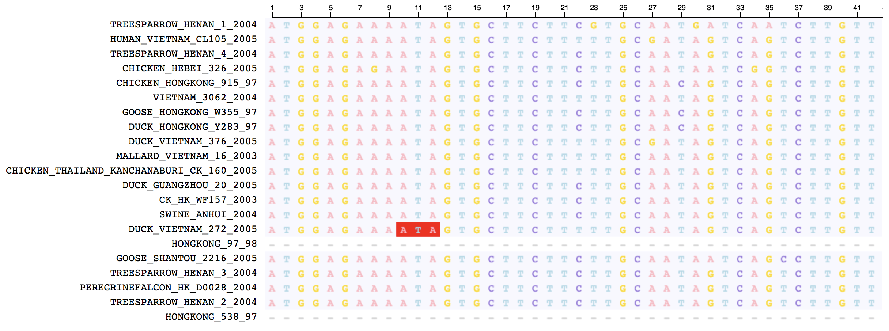
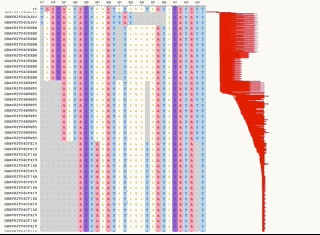

# alignment.js

A suite of reusable [React](http://reactjs.org/) components for creating a variety of visualizations involving [multiple sequence alignments](https://en.wikipedia.org/wiki/Multiple_sequence_alignment). [View the live demo here](http://alignment.hyphy.org/).

`alignment.js` can be used to create standard MSA viewers, utilizing functional programming to permit custom behavior such as highlighting individual sites:



as well as scaffold viewers for next-generation sequencing data where a reference sequence stays fixed to the top:



and joint phylogeny/alignment viewers using packages like [phylotree.js](https://github.com/veg/phylotree.js):


## Installation

`alignment.js` is [available on NPM](https://www.npmjs.com/package/alignment.js) and can thus be installed with `npm`

```
npm install alignment.js
```

or `yarn`

```
yarn add alignment.js
```

## Development

Install a local copy:

```
git clone https://github.com/veg/alignment.js
cd alignment.js
yarn
```

Start the development server:

```
yarn start
```
